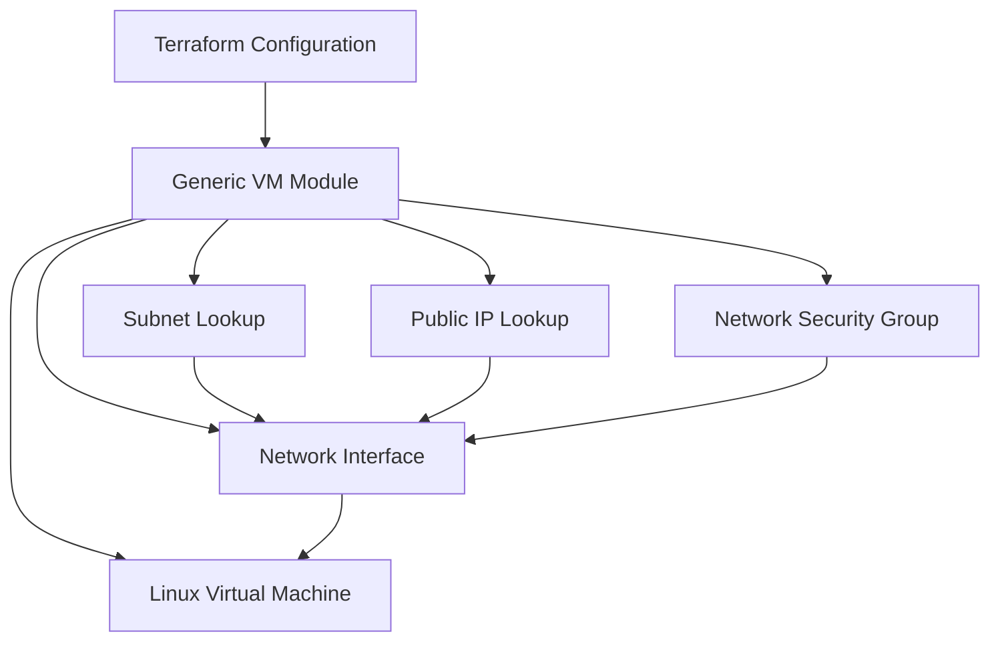

# 🚀 Azure Virtual Machine Generic Module

<p align="center">
  
</p>

<p align="center">
  
  
  
  
</p>

---

## 📌 Overview

A reusable and scalable Terraform module designed to provision multiple **Azure Linux Virtual Machines** using a single module declaration.

The module leverages:

* `for_each`
* Structured Objects
* Dynamic Blocks
* Optional Attributes
* Reusable Infrastructure Patterns

to deploy VMs, NICs, NSGs, Public IPs, and subnet associations efficiently.

---

## ✨ Key Features

| Feature                  | Description                               |
| ------------------------ | ----------------------------------------- |
| 🚀 Multi-VM Deployment   | Deploy multiple VMs using a single module |
| 🔄 Reusable Architecture | Generic and scalable Terraform design     |
| 🌐 Network Integration   | NIC, Subnet & Public IP support           |
| 🔐 Dynamic NSG Rules     | Create custom inbound/outbound rules      |
| ⚡ Modern Terraform       | Uses optional(), for_each, coalesce       |
| ☁️ Azure Native          | Built specifically for Azure workloads    |

---

## 🏗️ Architecture



---

## 📊 Module Capabilities

<p align="center">


</p>

---

## 📂 Project Structure

```text
Module/
└── azurerm_virtual_machine/
    ├── main.tf
    ├── variables.tf
    ├── data.tf
    └── README.md
```

---

## 🚀 Usage

### Module Declaration

```hcl
module "virtual_machines" {
  source  = "../Module/azurerm_virtual_machine"

  vm_list = var.vm_list
}
```

---

### Example Configuration

```hcl
vm_list = {
  frontend-web = {

    vm_name        = "vm-prod-web-01"
    vm_location    = "East US"
    rg_name        = "rg-production"

    vm_size        = "Standard_DS2_v2"

    nic_name       = "nic-web-01"

    vnet_name      = "vnet-prod"
    snet_name      = "snet-frontend"

    pip_name       = "pip-web-01"

    nsg_name       = "nsg-web-01"

    security_rules = [
      {
        name                   = "AllowHTTP"
        priority               = 100
        direction              = "Inbound"
        access                 = "Allow"
        protocol               = "Tcp"
        destination_port_range = "80"
      }
    ]
  }
}
```

---

## 🧩 Supported Configuration

| Resource                 | Support    |
| ------------------------ | ---------- |
| Azure Linux VM           | ✅          |
| Network Interface        | ✅          |
| Public IP                | ✅ Optional |
| Network Security Group   | ✅ Optional |
| Dynamic Security Rules   | ✅          |
| Custom Tags              | ✅          |
| Multiple Resource Groups | ✅          |
| Multi-VM Deployment      | ✅          |

---

## ⚙️ Execution Steps

### Initialize

```bash
terraform init
```

### Validate

```bash
terraform validate
```

### Plan

```bash
terraform plan -out=tfplan
```

### Deploy

```bash
terraform apply tfplan
```

### Destroy

```bash
terraform destroy
```

---

## 📈 Why This Module?

* Reduces Terraform code duplication
* Supports enterprise-style VM deployments
* Simplifies NSG and NIC management
* Easy to scale from 1 VM to multiple VMs
* Maintains clean Infrastructure as Code practices

---

## 👩‍💻 Author

**Priya Jaiswal**

Azure Cloud | DevOps | Terraform

<p align="center">
  <a href="https://github.com/Pjaisw1103">
    
  </a>
  <a href="https://linkedin.com/in/priya-jaiswal1103">
    
  </a>
</p>

---

<p align="center">
⭐ If this module helped you, consider giving the repository a star.
</p>
