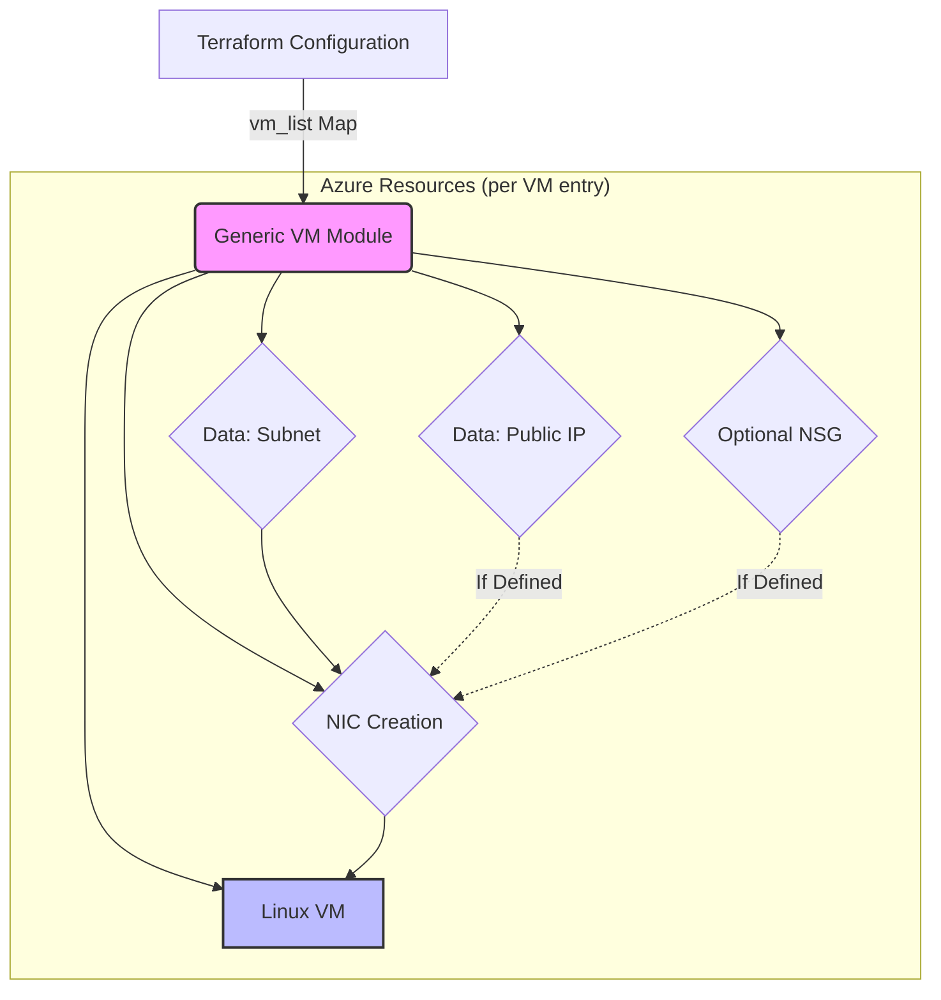

# 🚀 Azure Virtual Machine Generic Module

This module provides a scalable and generic approach to deploy multiple **Azure Linux Virtual Machines** using a single module declaration. It utilizes `for_each` and structured objects to manage complex configurations including Network Interfaces (NICs), Network Security Groups (NSGs), and Public IP addresses.

## 🏗️ Architecture Diagram



## 📂 Project Structure

```text
Module/azurerm_virtual_machine/
├── main.tf      # Core logic using for_each and dynamic blocks
├── variable.tf  # Structured variable definitions (Required & Optional)
├── data.tf      # Dynamic data lookups for Network resources
└── README.md    # Module documentation
```

## 🛠️ Key Features

- **Multi-VM Deployment**: Deploy an entire fleet of VMs with different configurations in a single block.
- **Generic & Flexible**: Supports custom NIC names, optional Public IPs, and conditional NSG associations.
- **Dynamic Security Rules**: Easily define multiple inbound/outbound rules per VM using dynamic blocks.
- **Modern Terraform Features**: Implementation uses `optional()` type constraints, `coalesce` for logic, and `base64encode` for custom data.
- **Resource Group Flexibility**: Allows resources (VNet/Subnet/PIP) to reside in different resource groups than the VM.

## 📖 Usage Guide

### 1. Module Declaration in `main.tf`

```hcl
module "virtual_machines" {
  source  = "../Module/azurerm_virtual_machine"
  vm_list = var.vm_list
}
```

### 2. Configuration Example in `terraform.tfvars`

```hcl
vm_list = {
  "frontend-web" = {
    vm_name         = "vm-prod-web-01"
    vm_location     = "East US"
    rg_name         = "rg-production"
    vm_size         = "Standard_DS2_v2"
    admin_password  = "ComplexPassword123!"
    
    nic_name        = "nic-web-01"
    snet_name       = "snet-frontend"
    vnet_name       = "vnet-prod"
    
    pip_name        = "pip-web-01" # Optional: Public IP name
    
    nsg_name        = "nsg-web-01" # Optional: NSG name
    security_rules  = [
      {
        name                       = "AllowHTTP"
        priority                   = 100
        direction                  = "Inbound"
        access                     = "Allow"
        protocol                   = "Tcp"
        destination_port_range     = "80"
        # ... other required rule fields
      }
    ]
  }
}
```

## 📝 Input Variables Reference (vm_list)

| Attribute | Type | Required | Default / Description |
| :--- | :--- | :---: | :--- |
| `vm_name` | `string` | **Yes** | The name of the Virtual Machine. |
| `vm_location` | `string` | **Yes** | Azure Region (e.g., East US). |
| `rg_name` | `string` | **Yes** | Resource Group for the VM. |
| `admin_password` | `string` | **Yes** | Admin password (sensitive). |
| `nic_name` | `string` | **Yes** | Name of the Network Interface. |
| `snet_name` | `string` | **Yes** | Target Subnet for the NIC. |
| `vnet_name` | `string` | **Yes** | Virtual Network containing the subnet. |
| `vm_size` | `string` | No | Default: `Standard_DS1_v2`. |
| `admin_username` | `string` | No | Default: `azureuser`. |
| `pip_name` | `string` | No | Set to attach a Public IP. |
| `nsg_name` | `string` | No | Set to create and attach an NSG. |
| `security_rules` | `list` | No | Custom firewall rules for the NSG. |
| `tags` | `map` | No | Resource metadata tags. |

---

---

## 🚀 How to Run

### 1️⃣ Prerequisites
- Azure CLI installed and authenticated (`az login`).
- Terraform v1.5+ installed.

### 2️⃣ Step-by-Step Execution
```bash
# Initialize the workspace and download providers
terraform init

# Validate the syntax and configuration
terraform validate

# Preview the changes
terraform plan -out=tfplan

# Apply the configuration
terraform apply "tfplan"
```

✨ *Optimized for Azure Infrastructure Automation*
