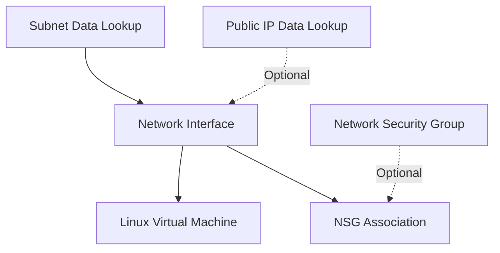

# Azure Virtual Machine Terraform Module

[](https://www.terraform.io/)
[](https://azure.microsoft.com/)
[](https://github.com/Pjaisw1103/Azurerm_Virtual_Machine)

A generic, scalable Terraform module for deploying and managing Azure Linux Virtual Machines. Built using modern Terraform constructs (`for_each`, dynamic blocks, optional attributes, and data lookups), this module allows you to provision single or multiple VMs, network interfaces, security groups, and public IP associations cleanly through a single map declaration.

---

## Features

- **Multi-VM Provisioning**: Deploy multiple Linux VMs dynamically using a single module block.
- **Dynamic Security Groups**: Configure customizable inbound/outbound NSG rules per virtual machine.
- **Flexible Network Association**: Attach existing subnets and optional Public IPs seamlessly using built-in data sources.
- **Customizable OS & Storage**: Easily specify custom OS images, disk caching policy, and storage account types.
- **Optional Credentials & Custom Data**: Supports password authentication, SSH keys, and custom bootstrap scripts (`custom_data`).

---

## Project Structure

```text
Azurerm_Virtual_Machine/
├── Environment/
│   ├── main.tf          # Environment composition & module invocations
│   ├── provider.tf      # Azure provider configuration
│   └── variables.tf     # Environment-level variables
└── Module/
    ├── azurerm_public_ip/
    ├── azurerm_resource_group/
    ├── azurerm_subnet/
    ├── azurerm_virtual_network/
    └── azurerm_virtual_machine/
        ├── main.tf      # Network interface, NSG, and VM resources
        ├── variable.tf  # Type schema definition for vm_list
        └── data.tf      # Data sources for Subnet and Public IP lookups
```

---

## Architecture


```mermaid
flowchart TD
    SubnetData[Subnet Data Lookup]
    PipData[Public IP Data Lookup]
    
    SubnetData --> NIC[Network Interface]
    PipData -. Optional .-> NIC
    
    NIC --> VM[Linux Virtual Machine]
    
    NSG[Network Security Group] -. Optional .-> NSGAssoc[NSG Association]
    NIC --> NSGAssoc
```

---

## Module Schema & Inputs

The module expects a `vm_list` variable of type `map(object({...}))`. Below are the key configuration attributes available for each VM entry:

| Attribute | Type | Required | Default | Description |
| :--- | :--- | :--- | :--- | :--- |
| `vm_name` | `string` | Yes | - | Name of the Azure Linux Virtual Machine |
| `vm_location` | `string` | Yes | - | Azure region (e.g., `East US`) |
| `rg_name` | `string` | Yes | - | Target Resource Group name |
| `vm_size` | `string` | No | `"Standard_DS1_v2"` | Azure VM SKU size |
| `admin_username` | `string` | No | `"azureuser"` | Administrative username |
| `admin_password` | `string` | No | `null` | Administrative password |
| `disable_password_authentication` | `bool` | No | `false` | Disable password authentication |
| `nic_name` | `string` | Yes | - | Name of the primary Network Interface |
| `snet_name` | `string` | Yes | - | Subnet name for network association |
| `vnet_name` | `string` | Yes | - | Virtual Network name for subnet lookup |
| `vnet_rg_name` | `string` | No | `rg_name` | Resource group of the VNet (if different) |
| `pip_name` | `string` | No | `null` | Public IP resource name (if attaching a Public IP) |
| `pip_rg_name` | `string` | No | `rg_name` | Resource group of the Public IP (if different) |
| `nsg_name` | `string` | No | `null` | Network Security Group name to create & attach |
| `security_rules` | `list(object)` | No | `[]` | Inbound/outbound NSG security rules |
| `tags` | `map(string)` | No | `{}` | Key-value pairs for resource tagging |

---

## Usage Example

### Module Declaration

```hcl
module "virtual_machines" {
  source  = "../Module/azurerm_virtual_machine"

  vm_list = var.vm_list
}
```

### Example `terraform.tfvars`

```hcl
vm_list = {
  web_server = {
    vm_name        = "vm-prod-web-01"
    vm_location    = "East US"
    rg_name        = "rg-production"
    vm_size        = "Standard_DS2_v2"
    admin_username = "azureuser"

    nic_name       = "nic-web-01"
    vnet_name      = "vnet-prod"
    snet_name      = "snet-frontend"
    pip_name       = "pip-web-01"

    nsg_name       = "nsg-web-01"
    security_rules = [
      {
        name                       = "AllowHTTP"
        priority                   = 100
        direction                  = "Inbound"
        access                     = "Allow"
        protocol                   = "Tcp"
        source_port_range          = "*"
        destination_port_range     = "80"
        source_address_prefix      = "*"
        destination_address_prefix = "*"
      },
      {
        name                       = "AllowSSH"
        priority                   = 110
        direction                  = "Inbound"
        access                     = "Allow"
        protocol                   = "Tcp"
        source_port_range          = "*"
        destination_port_range     = "22"
        source_address_prefix      = "*"
        destination_address_prefix = "*"
      }
    ]

    tags = {
      Environment = "Production"
      Role        = "Web"
    }
  }
}
```

---

## Deployment Workflow

```bash
# Initialize working directory
terraform init

# Validate syntax and configuration
terraform validate

# Review execution plan
terraform plan

# Apply changes to Azure
terraform apply
```

---

## Author

**Priya Jaiswal**  
Azure Cloud & DevOps Engineer

[GitHub](https://github.com/Pjaisw1103) • [LinkedIn](https://linkedin.com/in/priya-jaiswal1103)

